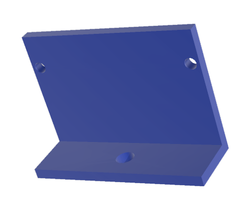
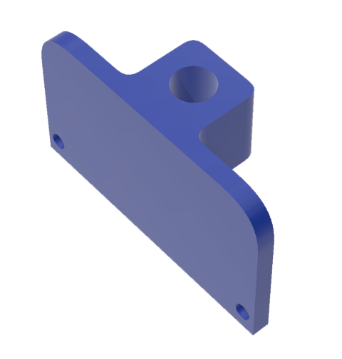
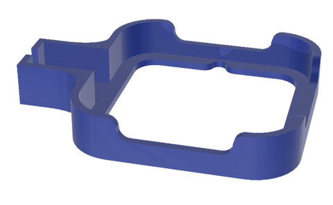
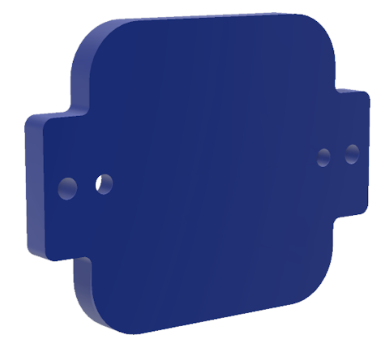

# RadarIQ 3D models
Several 3D models are available for RadarIQ mounting brackets

## 90 Degree mount
Angle bracket for mounting the RadarIQ-M1 sensor

## 90 Degree insert with insert
Angle bracket for mounting the RadarIQ-M1 sensor, with a hold to insert a metal nut etc.

## Press-fit cable
Securely holds the RadarIQ-M1 sensor with a press-fit as well as provides support to the USB cable.

## Reverse mount
Allow the RadarIQ module to be mounted to a surface, screwed from the front.

